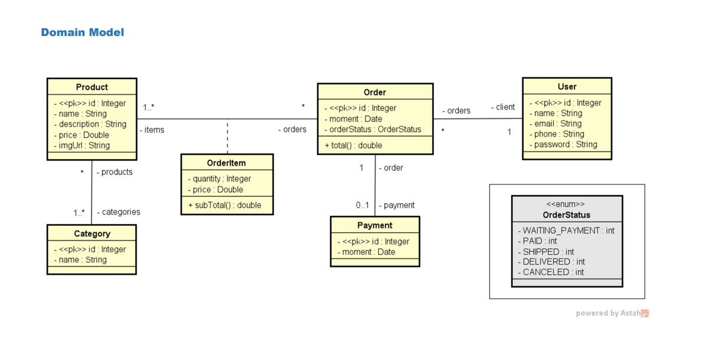
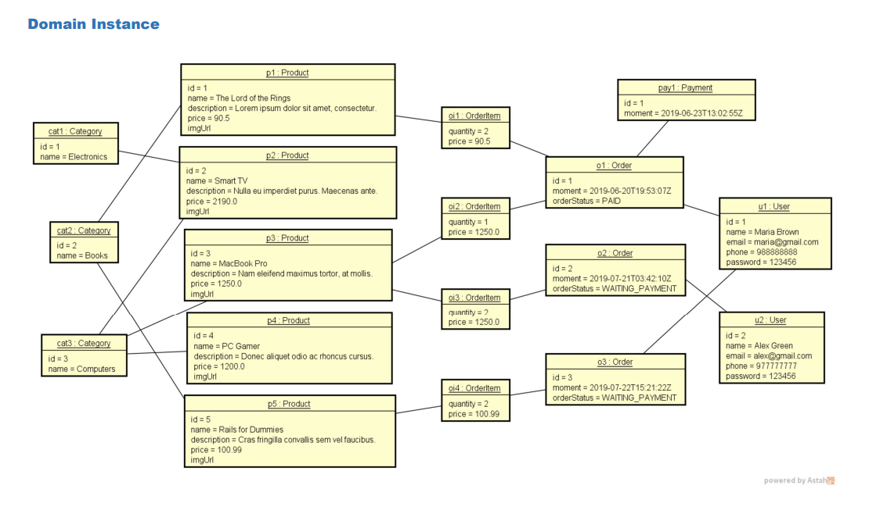

# Spring Boot e JPA / Hibernate

Este projeto é um Projeto web services. Ele foi criado por Dr. Nelio Alves.

## Objetivos

- Criar projeto Spring Boot Java
- Implementar modelo de domínio
- Estruturar camadas lógicas: resource, service, repository
- Configurar banco de dados de teste (H2)
- Povoar o banco de dados
- CRUD - Create, Retrieve, Update, Delete
- Tratamento de exceções

## GITHUB

- https://github.com/acenelio/workshop-springboot2-jpa
- https://github.com/acenelio/workshop-springboot3-jpa

##

##

